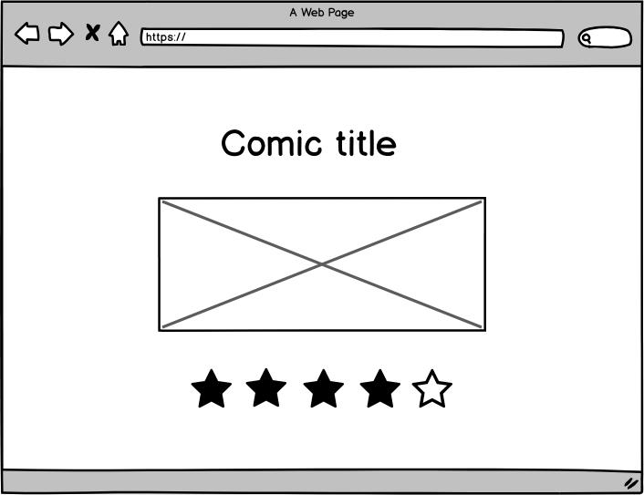

    

<h1 style="margin-top:10px;" align="center"> 
  ⏱ <strong> Masiv Comic - FrontEnd Test </strong> ⏱
</h1>

## 🚀 Objetivos

1. Consumir el API de xkcd: https://xkcd.com/json.html
2. Crear la siguiente pantalla mostrando un comic aleatorio de xkcd.
   
3. Permitir que el usuario califique el comic.

## ✅ La solución

Para devolver un cómic aleatorio, debemos conocer el rango de números de cómic. En este caso son secuenciales comenzando en 1 y terminando en 2583 hasta la fecha.

El máximo se incrementará en uno cada vez que se publique un nuevo cómic.

Llamar a la primera API siempre dará el cómic actual con el número máximo.

## 🛵 Como iniciar este proyecto.

1. Instalar Node >= v14.19.0
2. Instalar dependencias `yarn install` o `npm install`.
3. Correr el proyecto utilizando el comando `yarn run dev` o `npm run dev`.
4. Dirigirnos a https://cors-anywhere.herokuapp.com/corsdemo y presionar el botón `Request temporary access to the demo server` (Explicación más abajo).
5. Presionar `Get Random` para cargar un nuevo comic.
6. Disfruta!

## Explicación sobre el uso de `cors-anywhare`

El API de xkcd no tiene habilitado el CORS hasta el momento, así que tuve que utilizar un servidor externo que sirviera de intermediario (proxy).
